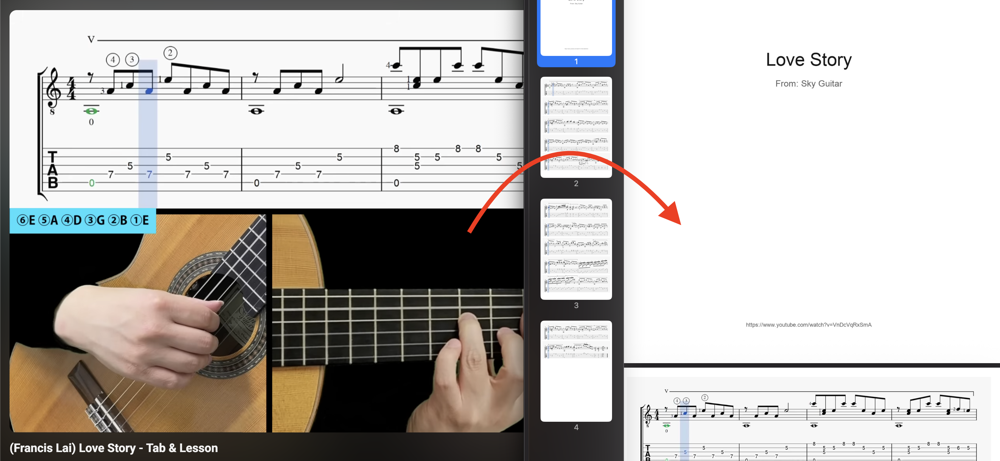

# TabCapture

A small local tool for turning guitar tab videos into clean PDF files.



TabCapture works with YouTube URLs and local video files. It samples frames, lets you choose the vertical area where the tab appears, ignores the moving playhead while comparing frames, removes duplicates, and builds a PDF from the unique tab screenshots.

## Setup

Create a virtual environment and install the dependencies:

```bash
python3 -m venv .venv
.venv/bin/python -m pip install --upgrade pip
.venv/bin/python -m pip install pillow opencv-python numpy yt-dlp flask
```

You also need `ffmpeg` available on your system for YouTube range downloads and preview clips.

## Standard Usage

Run the local web UI:

```bash
.venv/bin/python app.py
```

Then open `http://127.0.0.1:5000`.

## CLI Usage

The command line script is available for repeatable runs or quick tests.

From a YouTube URL:

```bash
.venv/bin/python tab_extractor.py "https://youtu.be/VIDEO_ID" --output tablatura.pdf
```

From a local video file:

```bash
.venv/bin/python tab_extractor.py video.mp4 --output tablatura.pdf
```

Useful options:

```bash
--start 195                  # start processing at a specific second
--end 300                    # stop processing at a specific second
--crop-y-start 0.50          # start the vertical crop lower in the video
--crop-y-end 1.00            # end the vertical crop at the bottom
--title "Love Story"         # override the PDF cover title
--channel "Creator Name"     # override the PDF cover credit
--keep-images                # keep extracted tab screenshots
--keep-comparison-images     # keep debug comparison images
--debug-diffs                # save visual diff images for duplicate decisions
```

When the source is a YouTube URL, the PDF cover automatically uses the cleaned video title and channel name when available. If `--start` or `--end` is used with a YouTube URL, only that video fragment is downloaded before extraction.

## Defaults

The defaults are tuned for recent Sky Guitar-like YouTube tab videos with a moving vertical playhead:

```bash
--sample-every 2
--crop-y-start 0.00
--crop-y-end 0.46
--band-half-width 90
--diff-threshold 0.010
```

## Example

Example Sky Guitar run:

```bash
.venv/bin/python tab_extractor.py "https://youtu.be/VnDcVqRxSmA?si=jjBvE64DAhj_mvO2" \
  --start 195 \
  --output tablatura.pdf
```
